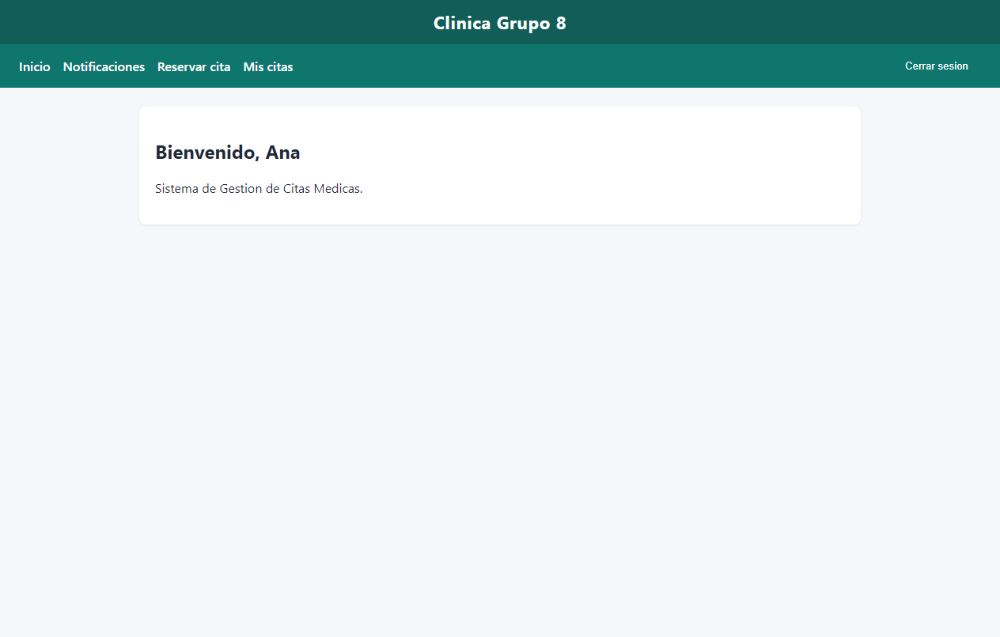
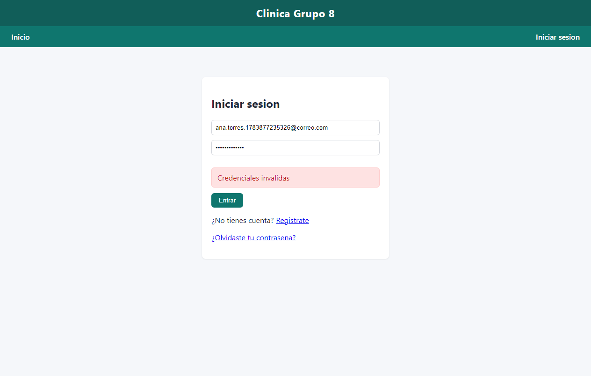
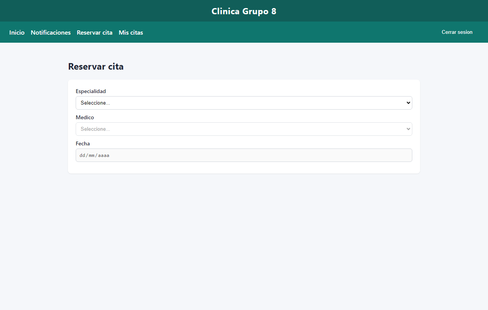
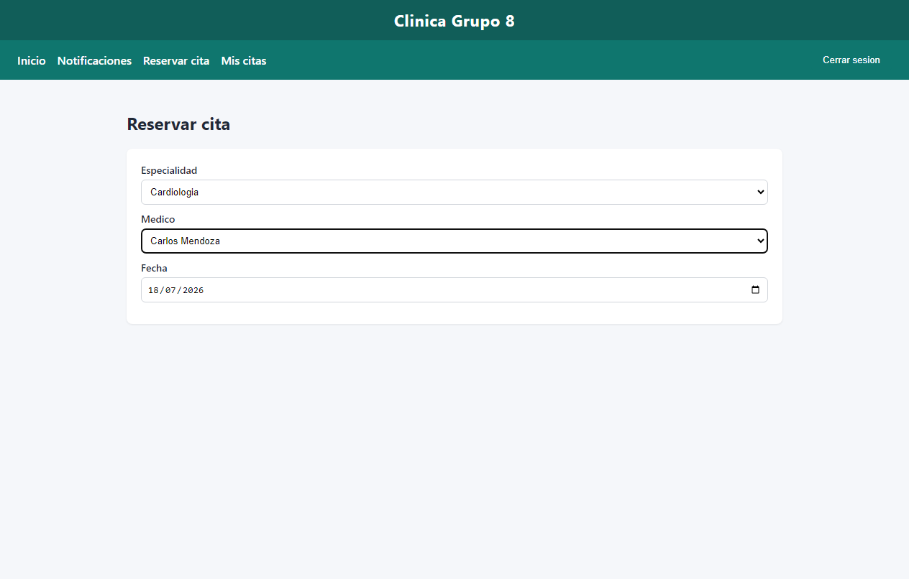
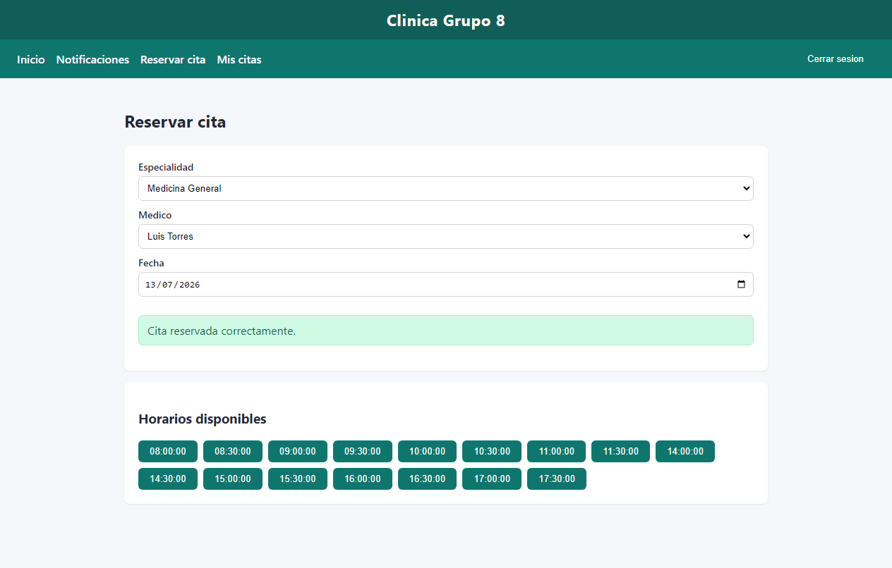
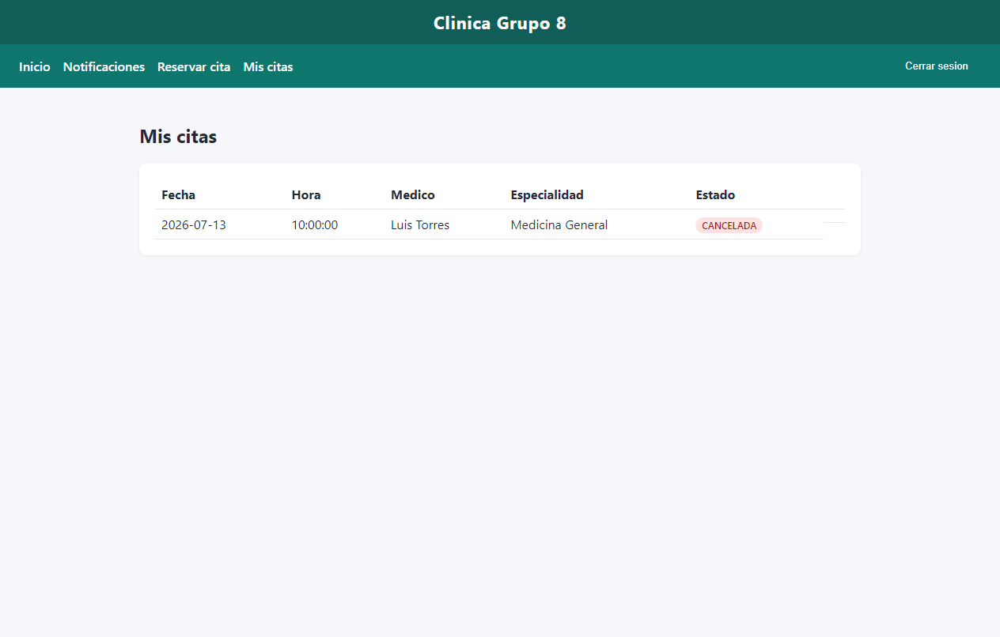
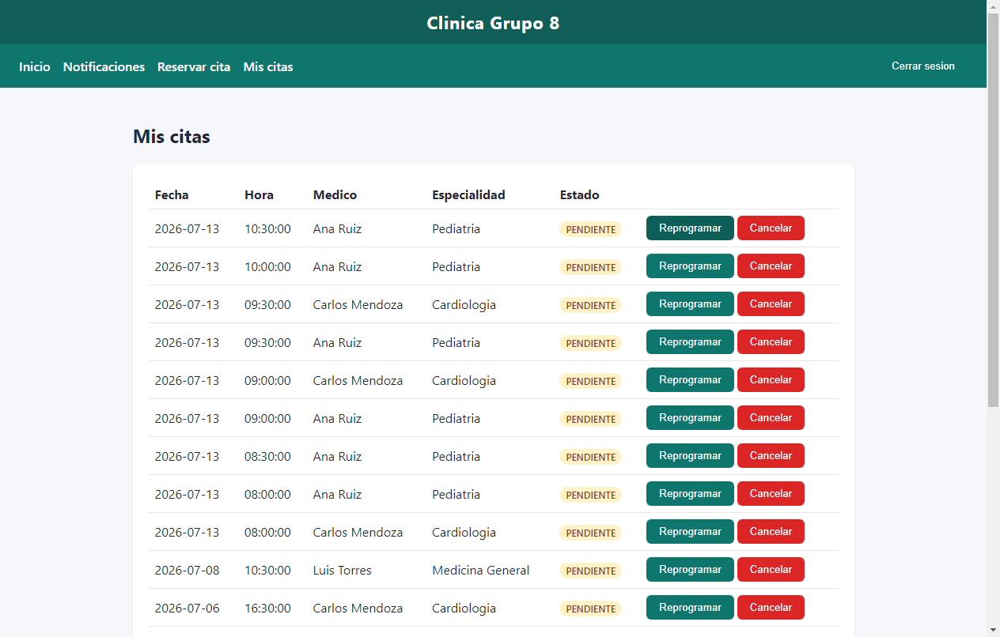

# Evidencia de automatización Selenium

## 1. Identificación del sistema

| Campo | Valor |
|---|---|
| Sistema | Sistema de Gestión de Citas Médicas — Clínica Grupo 8 |
| Frontend bajo prueba | `https://sistemacitas.vercel.app` |
| API | `https://sistemacitas.vercel.app/api` |
| Herramienta | Selenium WebDriver 4 + Chrome headless |
| Scripts | `frontend/tests/selenium/run.js` |
| Fecha de ejecución | 2026-07-12T17:27:13.903Z → 2026-07-12T17:28:08.642Z |
| Ejecutor | MarioADM |

## 2. Resumen de ejecución

- **Aprobados:** 7
- **Observados:** 1
- **Fallidos:** 0
- **Total:** 8

| ID | RF | Caso | Tipo | Estado | Tiempo | Evidencia |
|---|---|---|---|---|---|---|
| CP01 | RF01 | Registro exitoso de paciente | UI (Selenium) | **APROBADO** | 3766 ms | [captura](capturas/CP01_resultado.png) |
| CP02 | RF02 | Inicio de sesión con credenciales inválidas | UI (Selenium) | **APROBADO** | 4089 ms | [captura](capturas/CP02_resultado.png) |
| CP03 | RF03 | Listado de especialidades existentes | UI (Selenium) | **APROBADO** | 4335 ms | [captura](capturas/CP03_resultado.png) |
| CP04 | RF04 | Consulta de disponibilidad sin bloques configurados | UI (Selenium) + API | **OBSERVADO** | 10243 ms | [captura](capturas/CP04_resultado.png) |
| CP05 | RF05 | Reserva de cita en horario disponible | UI (Selenium) | **APROBADO** | 7236 ms | [captura](capturas/CP05_resultado.png) |
| CP06 | RF05, RNF05 | Intento de reserva simultánea sobre el mismo horario | API (doble sesión) | **APROBADO** | 4212 ms | — |
| CP07 | RF06 | Cancelación de una cita pendiente | UI (Selenium) | **APROBADO** | 5940 ms | [captura](capturas/CP07_resultado.png) |
| CP08 | RF07 | Reprogramación a un horario fuera de disponibilidad | UI (Selenium) + API | **APROBADO** | 9635 ms | [captura](capturas/CP08_resultado.png) |

## 3. Detalle por caso de prueba

### CP01 — Registro exitoso de paciente

- **Requisito:** RF01
- **Módulo:** Autenticación / Registro
- **Objetivo:** Verificar que un paciente nuevo pueda crear su cuenta con datos válidos y obtener acceso inmediato.
- **Datos de entrada:** Nombre: Ana; Apellido: Torres; correo único; teléfono: 987654321; contraseña válida.
- **Resultado esperado:** El sistema crea la cuenta, inicia sesión automáticamente y muestra la bienvenida al paciente.
- **Ruta / endpoint:** /registro → /
- **Resultado obtenido:** APROBADO



### CP02 — Inicio de sesión con credenciales inválidas

- **Requisito:** RF02
- **Módulo:** Autenticación / Login
- **Objetivo:** Verificar que el sistema rechace el acceso cuando la contraseña no corresponde a la cuenta.
- **Datos de entrada:** Correo del paciente registrado en CP01; contraseña: incorrecta123.
- **Resultado esperado:** El sistema rechaza el acceso, permanece en /login y muestra un mensaje de error genérico.
- **Ruta / endpoint:** /login
- **Resultado obtenido:** APROBADO



### CP03 — Listado de especialidades existentes

- **Requisito:** RF03
- **Módulo:** Reservas / Catálogo
- **Objetivo:** Verificar que el paciente autenticado vea el catálogo de especialidades al reservar.
- **Datos de entrada:** Sesión de paciente; especialidades seed del sistema.
- **Resultado esperado:** Se listan las especialidades activas (Cardiologia, Pediatria, Medicina General).
- **Ruta / endpoint:** /reservar
- **Resultado obtenido:** APROBADO



### CP04 — Consulta de disponibilidad sin bloques configurados

- **Requisito:** RF04
- **Módulo:** Reservas / Disponibilidad
- **Objetivo:** Verificar el comportamiento al consultar un día sin bloques de horario del médico.
- **Datos de entrada:** Médico de Cardiología; fecha: próximo sábado (sin horarios seed lun–vie).
- **Resultado esperado:** Mensaje claro de que no hay horarios disponibles (no lista vacía silenciosa).
- **Ruta / endpoint:** /reservar
- **Resultado obtenido:** OBSERVADO
- **Defecto relacionado:** DEF03



### CP05 — Reserva de cita en horario disponible

- **Requisito:** RF05
- **Módulo:** Reservas
- **Objetivo:** Verificar que el paciente pueda reservar un horario disponible.
- **Datos de entrada:** Medicina General; próximo lunes; primer slot libre (~10:00 si está libre).
- **Resultado esperado:** Mensaje «Cita reservada correctamente» y cita en estado pendiente.
- **Ruta / endpoint:** /reservar
- **Resultado obtenido:** APROBADO



### CP06 — Intento de reserva simultánea sobre el mismo horario

- **Requisito:** RF05, RNF05
- **Módulo:** Reservas / Concurrencia
- **Objetivo:** Verificar que solo una de dos reservas simultáneas al mismo slot sea aceptada.
- **Datos de entrada:** paciente@clinica.com y paciente2@clinica.com; mismo médico/fecha/hora.
- **Resultado esperado:** Una reserva confirmada y la otra rechazada por horario no disponible.
- **Ruta / endpoint:** POST /api/citas (paralelo)
- **Resultado obtenido:** APROBADO — Simultáneo 2026-07-13 10:30:00: HTTP 200/409 → aceptadas=1
- **Defecto relacionado:** DEF01

### CP07 — Cancelación de una cita pendiente

- **Requisito:** RF06
- **Módulo:** Mis citas
- **Objetivo:** Verificar que el paciente pueda cancelar una cita pendiente (CP05).
- **Datos de entrada:** Cita pendiente creada en CP05.
- **Resultado esperado:** Estado CANCELADA visible en Mis citas.
- **Ruta / endpoint:** /mis-citas
- **Resultado obtenido:** APROBADO



### CP08 — Reprogramación a un horario fuera de disponibilidad

- **Requisito:** RF07
- **Módulo:** Mis citas / Reprogramación
- **Objetivo:** Verificar que no se permita reprogramar a un horario fuera de los bloques del médico.
- **Datos de entrada:** Cita pendiente; intento API a las 19:00 (fuera de 08:00–12:00 / 14:00–18:00).
- **Resultado esperado:** La API rechaza 19:00 y la UI no ofrece ese horario.
- **Ruta / endpoint:** /mis-citas + PATCH /api/citas/{id}/reprogramar
- **Resultado obtenido:** APROBADO
- **Defecto relacionado:** DEF02



## 4. Trazabilidad requisitos ↔ pruebas

| Requisito | Caso(s) |
|---|---|
| RF01 Registro de paciente | CP01 |
| RF02 Autenticación | CP02 |
| RF03 Consulta de especialidades | CP03 |
| RF04 Disponibilidad de médico | CP04 |
| RF05 Reserva de cita | CP05, CP06 |
| RNF05 Control de concurrencia | CP06 |
| RF06 Cancelación de cita | CP07 |
| RF07 Reprogramación de cita | CP08 |

## 5. Cómo reproducir

```powershell
cd frontend
$env:BASE_URL = "https://sistemacitas.vercel.app"
npm run test:e2e
```

La evidencia se genera en `frontend/tests/selenium/evidencia/latest/`.
